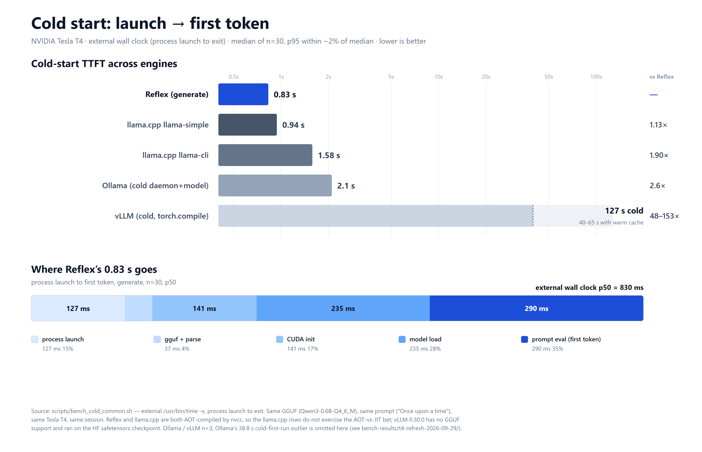

# Reflex

A GGUF-native Rust & CUDA inference engine built for **low-latency cold starts on
serverless GPU platforms** — process launch to first token, not sustained server
throughput.

Every CUDA kernel is compiled ahead-of-time by `nvcc` at *build* time and shipped
inside the binary — never compiled at runtime via NVRTC — so there's no multi-second
JIT tax on first use, the way there is with a runtime-compilation design. That's the
whole bet: be the fastest way to turn a cold process into one output token, then get
out of the way.

**Current cold start: ~456ms p50**, process launch to result — Tesla T4,
`Qwen3-0.6B-Q4_K_M`, `reflex system1`, `n=10`. Full phase breakdown
[below](#cold-start-phase-breakdown).

> **Architectural boundary — read before opening a PR.** Reflex is a **local
> execution engine for single-tenant agent decisions**. Scaling and HTTP APIs belong
> in the host orchestrator. This rules out, permanently, not just now: internal
> request queues/schedulers, continuous batching or PagedAttention-style dynamic KV
> allocation, multi-tenant LoRA routers, and any in-core HTTP/gRPC server. HTTP, if
> ever needed, is a *separate* sidecar binary ([`sidecar/openai-adapter`](sidecar/openai-adapter/README.md))
> over local IPC — never a socket inside this engine. See [Non-goals](#non-goals) for
> the full list and the rationale.

### Why serverless is the fit

On a serverless GPU platform (Runpod, and others with the same shape) you are billed
**per second of wall clock, per invocation** — and on several of them the cold-start
window is billed straight through to the caller as compute. For bursty, single-shot
work — an agentic tool-call, a classification, a structured extraction — time-to-ready
is not merely a latency property. It *is* the bill.

That inverts the usual ranking. A per-token API marketplace rewards packing many
concurrent requests onto one GPU, and an engine that deliberately never batches (see
[Non-goals](#non-goals)) cannot win there on cost per token. Per-second serverless
billing rewards the opposite: start fast, do one job, exit, stop the meter. Reflex's
constraints — one request at a time, no scheduler, no warm-pool assumption — stop being
limitations in that setting and start being the point.

The engine stays a single-shot process either way. The platform supplies the queue,
the autoscaling and the multi-tenancy; Reflex supplies a process that is ready fast.
See [`serverless/runpod/`](serverless/runpod/README.md) for the packaging, and the
[Serverless GPU platforms](#serverless-gpu-platforms-runpod) section for deployment.

**Real measurement, and a recalibration.** This has been deployed and tested end-to-end
against a real Runpod account (2026-09-26, real RTX A4500) — see
[`serverless/runpod/README.md`](serverless/runpod/README.md#real-deployment-findings-2026-09-26-real-rtx-a4500-on-runpod)
for the full detail. The result changes the claim: a real cold invocation took **~42-44
seconds wall clock**, of which Reflex's own load (container start to ready) was **~1.6
seconds** — the remaining ~40 seconds is Runpod's own GPU scheduling and container
provisioning, a floor that exists regardless of which engine runs on top of it. No engine
makes a serverless cold start on this platform sub-second, because most of the time
elapses before any engine code runs at all.

The claim this data actually supports is narrower than "Reflex starts in under a second
on serverless": it's that **Reflex adds near-zero marginal time on top of the platform's
own floor**, where a JIT/graph-compiling engine adds substantially more on top of that
same floor. **That comparison has since been run for real**: Runpod's own official
`worker-vllm` (52,327 deploys — the natural choice, not a self-built image), same GPU
tier, same platform, same day, took **~150 seconds** to a servable state versus Reflex's
~42-44 — **Reflex was ~3.4x faster**. Full methodology, disclosed caveats (different
model precision, different model-acquisition path, different endpoint type — none of
which change the direction of the result), and a real Runpod platform bug found along the
way (the autoscaler exceeding a configured `workersMax`) are in
[`docs/serverless-cost-comparison.md`](docs/serverless-cost-comparison.md). Also found and
fixed during this deployment: Runpod's load-balancer health check hits a hardcoded `/ping`
path regardless of documented override variables, and the request that triggers a cold
start can get a `502` from Runpod's own gateway even though the worker becomes healthy
moments later — both are now documented in the sidecar's and `serverless/runpod/`'s READMEs
for anyone else hitting the same platform.

## Quickstart

Requires the CUDA toolkit (`nvcc` on `PATH`, or `CUDA_PATH`/`CUDA_HOME` set) and an
NVIDIA GPU. `REFLEX_SKIP_CUDA=1 cargo build` skips kernel compilation for
editing/type-checking on a machine without CUDA (no subcommand will actually run
kernels in that mode).

```
git clone https://github.com/lateos-ai/reflex.git
cd reflex
cargo build --release

# Prove the AOT pipeline works end to end on your GPU:
cargo run --release --bin reflex -- smoke

# Run a real forward pass against a GGUF file:
cargo run --release --bin reflex -- generate <path-to-gguf> "Once upon a time"
```

`reflex` is a single binary with subcommands: `generate` (load a GGUF and generate
tokens), `system1` (single-pass, non-autoregressive candidate scoring — the "System 1"
decision-loop path), `smoke` (the AOT-pipeline check above), `bench` (warm-latency
microbenchmark), `check` (byte-exact-vs-reference correctness check, CI-scriptable),
and `stdio`/`uds` (local JSON-line IPC, both need `--features ipc`). Run `reflex
<subcommand>` with no further arguments to see that subcommand's own usage. For real
HTTP clients (OpenRouter, the OpenAI SDKs, curl), see
[`sidecar/openai-adapter`](sidecar/openai-adapter/README.md) — a separate
OpenAI-compatible `/v1/chat/completions` sidecar built on top of `reflex stdio`, not
part of the `reflex` binary itself (see Non-goals below).

## Build features: core engine vs. optional tooling

Reflex's **core engine** has a deliberately minimal dependency footprint: `cudarc`
(the CUDA driver + cuBLAS bindings), `half`, `memmap2`, and `rand` — no networking,
no serialization, no Python. Every optional capability is a **Cargo feature** that
stays off by default, so `cargo build --release` and `cargo build --release
--no-default-features` are identical today: neither pulls in a single optional
dependency (the empty `default = []` in `Cargo.toml` makes that a contract, not an
accident of omission). `--all-features` is a *developer convenience for testing the
feature matrix*, not a release build — see the table for what it drags in.

| feature | adds | extra host build dependency |
|---|---|---|
| *(none — core)* | `generate`/`system1`/`smoke`/`bench`/`check`, all four model architectures | CUDA toolkit only (`nvcc`) |
| `ipc` | `reflex stdio` / `reflex uds` (also enables `json-output` via `serde`) | none |
| `json-output` | `--json` on `generate`/`system1`/`bench`/`smoke`/`check`/`doctor` | none |
| `download` | `--model <org/repo:file.gguf>` / `--quickstart` (HF downloader via `hf-hub`) | `libssl-dev` + `pkg-config` on Linux (**not** Windows/macOS, where `hf-hub` uses a different TLS backend) |
| `nvml` | `reflex` energy instrumentation (dlopen'd `libnvidia-ml`, never linked) | none |
| `python` | PyO3 bindings (`src/python.rs`) | a Python 3.8+ interpreter on the build host (`pyo3-build-config` probes for it) |

The host-dependency story in one line: **only `download` (Linux) and `python` ever
need anything the core build doesn't**, and both are off by default. On Ubuntu/Debian
for the `download` feature specifically:

```
sudo apt-get install -y libssl-dev pkg-config
```

Every Dockerfile in this repo builds an explicit, minimal feature set (`--features ipc`
for the sidecar/Runpod/Modal images, feature-less for the root image) precisely so the
released artifacts never pay for `download`/`python` they don't use — see each
Dockerfile's `REFLEX_FEATURES`/`--features` line rather than assuming `--all-features`.

**Binary size.** The core build stays small by design: the Rust binary itself is on the
order of a few MB, and the AOT kernel bytes it embeds are tiny (the full `src/kernels_cuda/`
source is ~87KB; even a multi-arch fatbin stays far under the ~15MB ceiling this project
targets — well below the multi-GB CUDA base images the kernels are *not* re-shipped
inside). This is a stated target, not a CI-enforced number yet; a `REFLEX_SKIP_CUDA=1`
dev build (empty placeholder kernels) measures ~1.5MB, and the real CUDA build's exact
figure is re-confirmed per release rather than asserted here.

### Example: download a model from Hugging Face, then run a System1 test

`system1` takes a local GGUF path, so download the file first with the
[`hf` CLI](https://huggingface.co/docs/huggingface_hub/guides/cli) (`pip install -U
huggingface_hub`), then point `system1` at it — this scores each `--candidate`
against the prompt in a single pass, with no autoregressive decode loop:

```
hf download Qwen/Qwen3-0.6B-GGUF Qwen3-0.6B-Q8_0.gguf --local-dir .

cargo run --release --bin reflex -- system1 Qwen3-0.6B-Q8_0.gguf \
  "The capital of France is" \
  --candidate " Paris" --candidate " London" --candidate " Berlin"
```

Real output from this exact command (RTX A6000):

```
REFLEX_SYSTEM1_CANDIDATE_OK idx=0 text=" Paris" token_ids=[12095] score=17.407064 probability=0.997350
REFLEX_SYSTEM1_CANDIDATE_OK idx=1 text=" London" token_ids=[7148] score=11.308186 probability=0.002239
REFLEX_SYSTEM1_CANDIDATE_OK idx=2 text=" Berlin" token_ids=[19846] score=9.612655 probability=0.000411
REFLEX_SYSTEM1_OK process_start_to_result_ms=8524.253 num_candidates=3 best_idx=0 best_text=" Paris" entropy=0.028154
```

(That last capture is from an early pre-optimization build — the `token_id`s and scores
are current, but the `process_start_to_result_ms` figure predates perf items 2–6 and the
cold-load overlap round; see the [phase breakdown](#cold-start-phase-breakdown) for
current numbers.)

`probability` is relative to this candidate set only, not a vocab-wide probability —
see `Model::system1_evaluate`'s doc comment in `src/model.rs`. `system1` currently
supports dense/MoE Qwen3 only; the Qwen3.5 hybrid mixer and DeepSeek-V2/V3 (MLA) are
rejected with a clear error (`generate` supports all four architectures — swap in a
DeepSeek GGUF the same way for a `generate` run instead).

`generate` can also pull a GGUF straight from the Hub itself, via this project's own
Rust `hf-hub` integration — `--model <org/repo:file.gguf>` or `--quickstart`, both
requiring `cargo build --features download`:

```
cargo run --release --features download --bin reflex -- generate --quickstart "Once upon a time"
```

### Bringing your own model (non-GGUF checkpoints)

Reflex only ever loads GGUF — this is deliberate, not a missing feature (its
Hugging Face integration is a GGUF downloader/cache only, never a new
tensor-format ingestion path). If you have a safetensors/HF-format checkpoint,
convert it to GGUF first with llama.cpp's own unmodified `convert_hf_to_gguf.py`
— the same converter this project uses internally for its own test fixtures and
for real checkpoints like DeepSeek-V2-Lite:

```
python convert_hf_to_gguf.py /path/to/hf-checkpoint --outtype q8_0 --outfile model.gguf
```

LoRA adapters convert the same way, via llama.cpp's `convert_lora_to_gguf.py`.

## Why this exists

Closing the steady-state-throughput gap with llama.cpp/vLLM is a kernel-optimization
race against projects with a multi-year head start — Rust as a language doesn't change
who wins it. So this engine competes on the axis those projects are neither built for
nor measured against: a **cold** invocation.

That axis has a natural home. Serverless GPU platforms bill per-second per invocation,
so on bursty single-shot traffic the dominant cost is not tokens-per-second — it is how
long the worker takes to become useful. The same shape shows up in single-shot CLI and
dev-tool calls, batch/cron jobs, and edge devices that wake on demand; serverless is
just the case where the economics are explicit, because a slow start appears directly
on an invoice.

Everything else follows from taking that seriously. A naive runtime-JIT design pays a
real, measured multi-second tax on first kernel use. vLLM took ~235s to become ready
(CUDA graph capture) before serving one request — which is why an always-on deployment
is its realistic baseline, and why per-invocation scale-to-zero is impractical for it.
llama.cpp avoids both, because like Reflex its kernels are compiled by `nvcc` at
*build* time rather than at process start; it is the honest comparison point here, and
the benchmarks below treat it as one.

**Target metric**: energy-to-first-token from cold start (joules, process launch to
first generated token) — a real, underexplored gap. Existing energy benchmarks measure
warm/steady-state joules-per-token, not full-lifecycle cold-start cost.

**Energy instrumentation *and* measured energy numbers (real T4; see the phase table
below).** `src/energy.rs` samples GPU energy via NVML (`nvml-wrapper`, `dlopen`'d at runtime
behind the optional `nvml` Cargo feature — never linked at build time), preferring the
Volta+ monotonic `nvmlDeviceGetTotalEnergyConsumption` counter and falling back to polling
`nvmlDeviceGetPowerUsage` and integrating `power_mw * dt_s`. `generate`/`system1`/`smoke`/
`bench` emit per-phase `REFLEX_PHASE_OK` joules lines plus a total `joules` when available
(`--features nvml` on a machine that exposes NVML); `doctor` reports the method a real run
would actually use. These are now real-hardware-verified on a dedicated Tesla T4
(`g4dn.xlarge`): the cold-start phase table below carries a p50 **joules** column, and the
`polled_power` fallback — previously never exercised on real hardware, because that T4
always had the counter — is forceable with `REFLEX_NVML_FORCE_POLLED=1` and shown below
turning short-phase deltas non-zero. Two caveats are carried openly and were both observed:
NVML has no per-process energy API, so every figure is **device-wide** (accurate on a
dedicated/rented instance, an overcount on a shared GPU); and `total_energy_counter` mode
updates coarsely, so short phases (e.g. the ~39 ms scoring pass) legitimately read `0.000 J`
there — reported as-is, not smoothed over. The `polled_power` fallback integrates
continuously and does not have that granularity limit.

**Target models**: Qwen and DeepSeek families.

## Benchmarks

All comparisons are cold-start (process launch to first token/result), external
wall-clock (`/usr/bin/time -v` — process launch to exit, not just Reflex's own internal
timer), except the TypeSafe Jev *warm* rows below, which use a different,
explicitly-disclosed methodology. The `llama-simple`/`llama-cli`/Ollama/vLLM rows were
refreshed on 2026-09-29 on a dedicated AWS EC2 `g4dn.xlarge` (**Tesla T4**, driver
595.91.07 / CUDA 13.2), `n=30` per engine (`n=3` per Ollama scenario, `n=3` for vLLM),
single session, same `Qwen3-0.6B-Q4_K_M.gguf` and same prompt (`"Once upon a time"`) on
both sides; the TypeSafe Jev rows are unchanged from their own earlier measurements.
Full methodology, disclosed caveats, and per-run numbers for every comparison below are
in `DECISIONS.md` and `HISTORY.md`.

**Device-comparability caveat (disclosed, not buried).** This refresh could not run on
the published table's ThunderCompute A6000 — that GPU was unavailable — so it uses the
T4 fallback the refresh plan allows. That is not just a different card: the old A6000
rows were measured on ThunderCompute's GPU-virtualized instances, where *every* CUDA
process paid a multi-second post-result context-teardown tax through its virtualization
proxy (the issue behind Reflex's `fast_exit`; see `HISTORY.md`). On a dedicated AWS T4
that tax is absent, so **both** engines are far faster in absolute terms and the old
A6000 numbers are not directly portable. Both engines here ran on the same T4 in the
same session, so the ratio between them is sound; the absolute numbers are not
comparable to the old A6000 table. The harness was re-validated first (same
`bench_cold_common.sh`, same commands): llama.cpp no longer reads ~6.5s precisely
because the virtualized-teardown tax it used to pay is gone — a host-class difference,
diagnosed before any number was trusted, not a harness change.

### Cold-start: local process launch vs. `llama-simple` / `llama-cli` / Ollama / vLLM

These compare a *cold* local process launch (Reflex) against llama.cpp's front-ends,
Ollama, and vLLM. Note the AOT truth before reading the "avoids runtime JIT" claim into
every row: `llama-simple`/`llama-cli` and Ollama's bundled `llama-server` are, like
Reflex, compiled ahead-of-time by `nvcc` at *build* time — none pays a runtime CUDA JIT
tax, so those rows measure *other* cold-start overheads (model load, packaging, GPU
discovery), and only the vLLM row actually exercises Reflex's no-runtime-JIT bet.

Reflex's own number on this device (`reflex generate`, `n=30`): **p50 0.83s / p95 0.84s**,
peak RSS 982 MB.

| vs. (cold process launch, Tesla T4, `n=30`) | Result (p50; p95 in parens) | Caveat |
|---|---|---|
| **llama.cpp `llama-simple`** (true prompt-in/token-out) | **Reflex ~1.13x faster** (0.83s [0.84s] vs. 0.94s [0.96s]) | Both AOT-compiled. On this dedicated T4 the win is Reflex's optimized cold load, *not* the `fast_exit` teardown fix — that only mattered on ThunderCompute's virtualized A6000; doesn't exercise the JIT-tax claim |
| **llama.cpp `llama-cli`** | **Reflex ~1.9x faster** (0.83s vs. 1.58s [1.59s]) | `llama-cli` always applies the model's chat template even with `-p` (a documented gotcha), so `llama-simple` is the true prompt-in/token-out row; kept for continuity with the published table |
| **Ollama (bundled `llama-server`)** | **Reflex ~2.6x faster** (0.83s vs. ~2.1s cold daemon + cold model; warm model ~7–11ms) | Wraps llama.cpp's AOT runtime; tests packaging/daemon overhead. The published ThunderCompute watchdog stall did **not** recur here (0 of 9 runs); one 38.8s cold-first-run outlier is disclosed in `HISTORY.md`, not averaged away |
| **vLLM** | **Reflex ~48–150x faster** (0.83s vs. 39.8–127.3s, depending on `torch.compile` cache state) | **The actual AOT-vs-JIT foil** — vLLM's CUDA graph capture + `torch.compile` warmup at cold start. Installed vLLM 0.30.0 still has no GGUF support; ran against the HF safetensors checkpoint instead, disclosed |



*Figure: cold start = process launch → first token, external wall clock, Tesla T4,
`Qwen3-0.6B-Q4_K_M`, `n=30` (`n=3` Ollama/vLLM). Left: Reflex vs the other engines on a
log axis, so vLLM stays visible. Right: where Reflex's 0.83s goes. Editable vector source:
[`docs/cold-start-t4.svg`](docs/cold-start-t4.svg).*

### Warm-API: Reflex (warm compute) vs. TypeSafe Jev (always-warm managed API)

These compare Reflex's warm-compute side against Jev, an always-warm managed decision API
— the structural opposite of a cold local process. Different, explicitly-disclosed
methodology (see `HISTORY.md`).

| vs. | Result | Caveat |
|---|---|---|
| **TypeSafe Jev**, cold-start-to-decision | Reflex loses, **~33–62x slower** (18.96s vs. Jev's independently measured 307.8–569.6ms) | Different deployment model: Jev is an always-warm managed API; this measures a genuine cold local process launch. Jev's side is now a real measurement (via OpenRouter), not a citation — see HISTORY.md |
| **TypeSafe Jev**, warm compute-only | **Competitive, within ~1.3–2x** (19.4ms vs. Jev's cited 10–15ms) | Jev's *compute-only* figure is self-reported/published — structurally unmeasurable from outside their infra, still a citation |
| **TypeSafe Jev**, warm, both over the network (independently measured) | Reflex 118.8–224.9ms (network floor to a live sidecar + 20.9ms compute) vs. Jev 120.6–190ms (measured round-trip) — **roughly 10% apart at p50, Jev's max is actually better** | The fairer comparison: both sides now carry real network transit. Reflex's number is a construction (measured floor + measured compute, not one live decision call); Jev's is a direct measurement. See HISTORY.md's "Making the Jev comparison genuinely apples-to-apples" entry |

The llama.cpp/Ollama/Jev "loses" results above are reported as-is, not smoothed over —
see `DECISIONS.md`'s benchmark-methodology entries for why each comparison is framed
the way it is.

### Cold-start phase breakdown

A single aggregate number hides where the time actually goes, so both `reflex generate`
(on its `REFLEX_GENERATE_OK` line) and `reflex system1` (on `REFLEX_SYSTEM1_OK`) report
per-phase timings (`gguf_open_ms`, `cuda_init_ms`, `model_load_ms`, `prompt_eval_ms`,
each a delta between `Instant::now()` checkpoints around the corresponding call), and
`scripts/bench_cold_start_phases.sh <gguf> [n_runs]` /
`scripts/bench_cold_start_phases_system1.sh` run them N times (fresh cold process each
time, external `/usr/bin/time -v` wall clock, raw logs kept, no results discarded) to
report p50/p95 per phase instead of one sample. "Process launch" (OS
`exec`/dynamic-linking/CRT init before `main()` runs) isn't something the process can
report about itself — it's derived as external wall clock minus the internal total,
the same gap this page's other benchmark numbers already rely on.

Each of those phases also gets an **additive** `REFLEX_PHASE_OK phase=<name>
duration_ms=<ms> energy_joules=<j> energy_method=<m>` line (one per phase, printed
*before* the aggregate result line; the `energy_*` fields are present only when a
measurement is available), with the same fields in the `--json` form. The existing
`REFLEX_GENERATE_OK`/`REFLEX_SYSTEM1_OK` lines and their fields are unchanged. The
per-phase `energy_joules` is the delta between consecutive cumulative readings, so its
precision follows the mode caveat above (coarse in `total_energy_counter` mode for very
short phases; continuous in `polled_power` mode). The four phases span process-start
*through the first token*, so they need not sum to the aggregate `joules` — for
`generate --max-tokens N>1` the aggregate also covers post-first-token decode, and in
`total_energy_counter` mode counter quantization can make the sum differ from the
aggregate even for `system1` (both observed on a real T4: sub-50ms phases read `0.000 J`,
and a phase sum matched the aggregate in some runs but was one counter-tick short in
others).

The same additive treatment covers the other subcommands with a real phase boundary:
`reflex smoke` emits `cuda_init` / `kernel_load` / `kernel_launch`, and `reflex bench`
emits its model-load sequence (`gguf_open` / `cuda_init` / `model_load`) ahead of its
existing per-bucket `REFLEX_BENCH_ENERGY_OK` line. `reflex doctor` emits **no** phase line
and no total joules — it runs no timed execution phase, only cheap boolean checks, so it
reports the energy *method* a real run would use (`nvml_energy` check) instead of inventing
a phase to measure.

**Current numbers, real `Tesla T4` (dedicated AWS EC2 `g4dn.xlarge`), `Qwen3-0.6B-Q4_K_M.gguf`,
`reflex system1`, `n=10`** (`REFLEX_CUDA_ARCH=sm_75`, driver 595.91.07 / CUDA 13.2;
`scripts/bench_cold_start_phases_system1.sh`, which now also aggregates the
`REFLEX_PHASE_OK` `energy_joules` fields; raw per-run logs kept under `bench-results/`):

| phase | p50 ms | p95 ms | p50 joules (`total_energy_counter`) |
|---|---|---|---|
| process launch (external − internal) | 112.1 | 125.3 | n/a (pre-`main`) |
| gguf open + metadata parse | 64.2 | 67.0 | 0.000 |
| CUDA init (`CudaDevice::new`) | 142.3 | 144.0 | 3.662 |
| model load (kernel module load + weight dequant/upload; tokenizer and cuBLAS init overlapped on a worker thread) | 235.1 | 244.4 | 9.613 |
| scoring pass (single forward pass) | 39.2 | 39.5 | 0.000 |
| **total** (`process_start_to_result_ms`) | **485.4** | **494.0** | **20.324** |

The joules column is exactly as measured, not cleaned up: the ~39 ms scoring pass and the
~64 ms GGUF parse both round to `0.000 J` at the counter's granularity, and the per-phase
joules need not add to the total (counter quantization can place a phase's joules in the
previous boundary's snapshot). That is the device-wide/counter caveat in practice.

Forcing the `polled_power` fallback (`REFLEX_NVML_FORCE_POLLED=1`, same `n=10`) makes those
short phases measurable — the reason the fallback exists:

| phase | p50 ms | p50 joules (`polled_power`, forced) |
|---|---|---|
| gguf open + metadata parse | 61.6 | 0.957 |
| CUDA init | 187.9 | 7.129 |
| model load | 267.1 | 11.888 |
| scoring pass | 40.4 | 1.450 |
| **total** | **556.5** | **21.433** |

This T4 would normally take the counter branch (`reflex doctor` reports
`method=total_energy_counter`), so the polled path is forced here only to exercise it. Two
honest costs of that path: the polling thread adds wall-clock on this small 4-vCPU instance
(CUDA init 142→188 ms, model load 235→267 ms), and the polled totals run slightly higher
than counter mode — partly that extra time, partly the counter's coarse undercount. Both are
real and disclosed rather than hidden. `scripts/bench_cold_start_phases.sh` (the `generate`
variant) reports the same columns for the first-token metric (`total` p50: 755.8 ms /
32.16 J counter; 836.3 ms / 35.28 J forced-polled). The other benchmark tables above stay
latency-only because only Reflex emits NVML energy — llama.cpp/vLLM/Jev have no comparable
joules figure to put in a column.

On this dedicated instance the spread was tight (p95 within ~1–4% of p50 per phase in the
table above), unlike the shared-rented-instance variance discussed below.

That ~485ms is down from **3502.8ms** in this table's previous revision — but that
older figure was a *different measurement* (`reflex generate`, `Q8_0`, rented `NVIDIA
L40`), so it is not a like-for-like multiple and shouldn't be quoted as one. On this same
T4/`Q4_K_M`/`system1` setup the starting point was **~1248.6ms** (mean of `n=5`, before
the warm-latency perf plan) and it is **~485ms** (p50 of `n=10`) now — roughly a 2.6x
improvement, delivered first by that plan's items 2–6 (warp-per-row `gemv`, lazy
`lm_head`, phase instrumentation, pipelined model load, lazy `token_embd` dequant), then
by a cold-load overlap round (a fast non-cryptographic tokenizer hasher, and the
tokenizer construction + cuBLAS handle init moved onto a single worker thread overlapped
with the weight load). The intermediate per-item before/after numbers are recorded in
`STATUS.md` and `HISTORY.md`; they come from separate measurement runs and don't form one
continuous series, so they're not chained here.

What this breakdown shows now: **CUDA init is small and stable** (~140ms — this is
`CudaDevice::new`, not kernel loading). The AOT bet shows up *inside* model load: the
*entire* dense kernel-module load (rmsnorm, rope, silu, gemv, gemv_gather, attention,
attention_prefill, elementwise, dequant) measures **~3ms** in pinned-cubin mode (and
~3.5ms in portable PTX) — no JIT tax hiding there. **Model load is now ~237ms of the
~485ms total (~49%)**, dominated by two memory-bound pieces: the per-tensor weight
dequant/upload loop (~124ms) and the `token_embd` raw-byte copy (~102ms, mmap page-fault
cost rather than compute). Tokenizer construction (~100ms) and cuBLAS handle init
(~81ms) — the two remaining host/driver setup costs the item-6 profiling surfaced — are
now built concurrently on a single worker thread and no longer sit on the serial path at
all. There is no longer any measured host-setup cost left to overlap; the remaining
model-load time is bandwidth-bound. See `STATUS.md`/`HISTORY.md` for the per-item A/Bs
and this correction's provenance.

**Note on `reflex generate` with a *tied*-embedding model** (no separate `output.weight`
— which includes `Qwen3-0.6B`): the lazy `token_embd` optimization (perf item 6)
initially left a **+110ms (+9%) regression** on that specific path, because the
full-vocab dequant it defers for `system1` is still needed for `generate`'s greedy
argmax, so the cost was only *moved* from `model_load_ms` into `prompt_eval_ms`. That
regression is now **closed and turned into a win**: the tied full-vocab dequant moved
on-device (2026-09-28), cutting `prompt_eval_ms` by ~426ms on that path in its own A/B
(`generate` total ~1314ms → ~894ms there). See `STATUS.md` and `HISTORY.md`.

**The comparison table has since been refreshed** (2026-09-29, dedicated AWS T4): the
`llama-simple`/`llama-cli`/Ollama/vLLM rows above are current measurements of this code,
not the pre-perf-items A6000 figures. See `HISTORY.md`'s "Cold-start comparison table
refresh" entry for the device, driver, `n`, per-engine p50/p95, the harness-validation
diagnosis, and the raw-log location.

Also disclosed rather than smoothed over: in the earlier L40 measurements, two batches
in the same session showed materially different noise levels across *every* run of the
second batch, not just a single outlier, pointing at real host-level contention on a
shared rented GPU instance. **Session-to-session variance on rented cloud GPU hardware
can exceed intra-session variance**, so treat any single-session cold-start number as
illustrative, not lab-controlled.

**Host-vs-container/cgroup, and persistent-vs-`exec`'d — both closed** (2026-09-27, real
Tesla T4 `g4dn.xlarge`, `Qwen3-0.6B-Q4_K_M.gguf`, `REFLEX_CUDA_ARCH=sm_75` pinned-cubin
build on both sides so the comparison isn't confounded by JIT-vs-cubin, `n=10` each):

**Host vs. container.** Same binary, same pinned cubin, run bare (`/usr/bin/time -v
./target/release/reflex generate ...`) vs. inside `docker run --rm --gpus all` against
this repo's own root `Dockerfile` image (already built and resident locally — this
isolates container *runtime* overhead, not registry image-pull time):

| | internal total (`process_start_to_first_token_ms`, p50) | external wall clock (p50) | derived launch overhead |
|---|---|---|---|
| Host (bare process) | 1303.9 ms | ~1400 ms | ~96 ms |
| Container (`docker run --gpus all`) | 1288.3 ms | ~1800 ms | ~512 ms |

Reflex's own internally-reported total is statistically identical either side (1303.9ms
vs. 1288.3ms, well within run-to-run noise) — the ~400ms/~29% gap in external wall clock
is entirely attributable to Docker's own container-launch machinery (dispatch to
`dockerd`, OverlayFS mount, cgroup/namespace setup, the NVIDIA Container Toolkit's device
injection), not to anything about CUDA execution being slower inside a container. Both
sides' first run of `n=10` was an outlier and is excluded from the p50s above rather than
smoothed into them: the container's first run paid an extra ~1.3s in `cuda_init_ms`
(1400ms vs. ~140ms on every subsequent run — plausibly the container's first-ever access
to the GPU device nodes through a fresh network/cgroup namespace) and the host's first run
paid an extraordinary ~16.5s inside `model_load_ms` alone (`cuda_init_ms` on that same run
was a normal 141.8ms) — real, logged, and unexplained rather than hand-waved: not
reproducible on any of the other 9 host runs, and not matching any known page-cache-cold
explanation (the model file had just been written to the same filesystem, so it should
already have been page-cache-resident). Flagged honestly as an open question for whoever
re-runs this, not swept under "variance."

**Persistent vs. `exec`'d.** `reflex stdio` started once, `REFLEX_STDIO_READY` awaited,
then 10 requests sent to the *same* resident process over its existing JSON-line IPC
(`scripts/`-adjacent throwaway harness, not a checked-in script — see `src/ipc.rs`) vs.
the cold per-process total above:

| | p50 | note |
|---|---|---|
| Cold, one process per request (this project's actual design) | 1303.9 ms | CUDA init + full model load + first token, every time |
| Persistent, resident process, steady state (requests 2–10) | 16.35 ms | pure inference + IPC round-trip, no reload |
| Persistent, resident process, *first* request after ready | 708.96 ms | one-time compute-kernel warmup cost `REFLEX_STDIO_READY` doesn't capture |

A resident process's steady-state request is **~80x faster** than this project's own
cold-start design — expected and not a criticism of the architecture (a resident,
always-on server is exactly the `batch_size`-1/no-thread-pool serving-platform shape this
project's Non-goals deliberately reject; see [Non-goals](#non-goals)). What's genuinely useful
here: the gap between a resident process's *first* request (708.96ms) and its *second*
(16.35ms) shows that even a fully warm, already-loaded model still pays a real one-time
cost the first time it actually runs its compute kernels — a cost `model_load_ms` doesn't
capture because weight upload uses dequant/memcpy kernels, not the attention/GEMV kernels
a real forward pass launches for the first time. That first-real-inference tax is not
currently broken out as its own phase; doing so is a plausible future refinement of this
breakdown, not scoped here.

## Core technical bet

Every CUDA kernel is compiled **ahead of time** (`build.rs` invokes `nvcc`, see
`build.rs` and `src/kernels_cuda/`), never at runtime via NVRTC. `src/aot.rs` loads the
precompiled bytes at process start via the CUDA driver API. Three output modes, chosen
by env var (`REFLEX_CUDA_ARCH` and `REFLEX_CUDA_ARCHS` are mutually exclusive):

| env var | output | load behavior | fits |
|---|---|---|---|
| *(neither)* | portable **PTX** | driver JIT-to-SASS at load, any GPU | the safe default for a distributed image |
| `REFLEX_CUDA_ARCH=sm_XX` | single-arch **cubin** | zero JIT, exactly that one GPU, hard-fails elsewhere | a known, pinned SKU |
| `REFLEX_CUDA_ARCHS=sm_XX,sm_YY,...` | **fatbin** (one cubin per listed arch + an embedded forward-compatible PTX) | zero JIT on any listed arch, driver-JIT fallback on anything newer | a mixed-architecture GPU pool (e.g. Runpod's `AMPERE_16`, see [below](#serverless-gpu-platforms-runpod)) |

The fatbin mode is build.rs's answer to "ship one image, run natively on many GPU
generations without a per-arch rebuild": `nvcc -fatbin` with one
`-gencode arch=compute_XX,code=sm_XX` per listed arch, plus a trailing
`-gencode arch=compute_<highest>,code=compute_<highest>` that embeds PTX for the
highest listed arch so a GPU *newer* than everything listed still loads (via driver
JIT) instead of failing. Example:

```
REFLEX_CUDA_ARCHS=sm_75,sm_80,sm_86,sm_89,sm_90 cargo build --release
```

`cargo build` panics if *both* `REFLEX_CUDA_ARCH` and `REFLEX_CUDA_ARCHS` are set.
A fatbin embeds one SASS image per arch, so it is fatter than a single pinned cubin —
the traded-off binary size is the honest cost of not maintaining one image per GPU
generation. `reflex doctor` reports the build's `kernel_format` and, for a fatbin,
whether the detected GPU gets a native (zero-JIT) image or falls back to the embedded
PTX.

**Portable PTX is only cheap when the driver's JIT cache is warm.** Measured on a real
T4 (driver 595.91.07, CUDA 13.2, `Qwen3-0.6B-Q4_K_M`, `reflex system1`, p50 of 10
interleaved runs, 2026-09-30):

| build | kernel files | `reflex` binary | `model_load_ms` p50 | total p50 |
|---|---|---|---|---|
| portable PTX, **no** JIT cache | 0.50 MB | 3.02 MB | **1061** | 1272 |
| portable PTX, warm JIT cache | 0.50 MB | 3.02 MB | 246 | — |
| cubin `REFLEX_CUDA_ARCH=sm_75` | 0.39 MB | 2.92 MB | 250 | 473 |
| fatbin `REFLEX_CUDA_ARCHS=sm_75,sm_80,sm_86,sm_89,sm_90` | 2.10 MB | 4.63 MB | 253 | 475 |

The driver caches JIT output under `~/.nv/ComputeCache`. With that cache warm, PTX loads
as fast as a cubin (an earlier measurement of ~3 ms module load for either mode was taken
this way). Without it, every process pays the JIT again: about **+0.8 s per cold start**
on this kernel set. That is the normal case for a fresh container, a serverless worker, or
a process run with no `HOME` or with `CUDA_CACHE_DISABLE=1`. So the deploy images default
to a pinned cubin or a fatbin, and a fatbin costs nothing measurable over a pinned cubin
at load time (253 vs. 250 ms, within noise) for about 1.7 MB more binary.

Three more things the same run established:

- **A fatbin's PTX fallback only covers *newer* GPUs.** The embedded PTX targets the
  highest listed arch, so it JITs on a GPU at least that new, but a GPU *older* than every
  listed arch can't load the kernels at all (`REFLEX_CUDA_ARCHS=sm_80,sm_86` on a T4 fails
  with `CUDA_ERROR_NO_BINARY_FOR_GPU`). `Model::load` and `reflex doctor` now report that
  case in plain English up front.
- **An unlisted GPU with the same major version still loads natively.** CUDA runs an
  `sm_86` image on `sm_87`/`sm_89`, so `reflex doctor` reports those as native, not JIT.
- **CUDA 13's `nvcc` can't target `sm_70` or older** (`Unsupported gpu architecture
  'compute_70'`), so with a CUDA 13 toolkit `sm_75` (T4) is the oldest possible entry.

Run `cargo run --bin reflex -- smoke` on a real GPU instance as the very first
real-hardware step: it proves the AOT pipeline works end to end and reports actual
process-start-to-first-result wall clock on the simplest possible kernel, before any
model-architecture work begins.

## MVP order

All four steps below are **done** and real-hardware-verified (see `STATUS.md` for
current state, `HISTORY.md` for the full verification write-up of each):

1. **Dense Qwen3** — the best-understood, most well-documented architecture to build
   against first; proves the AOT-compilation + cold-start-benchmark harness works at all.
2. **Qwen3-MoE**
3. **Qwen3.5 hybrid Gated DeltaNet mixer**
4. **DeepSeek-V2/V3 MLA** — deliberately last; a genuinely different (compressed
   latent-KV) caching strategy, not an incremental GQA extension.

### Future architecture additions (breadth on demand, not a roadmap axis)

The four families above cover the architectural *mechanisms* — dense attention, sparse
MoE, hybrid linear attention, latent-KV attention. Further coverage is added only when a
concrete target model pulls it, never chased for its own sake: broad model support is
llama.cpp's axis, not this engine's (see [Non-goals](#non-goals) — the same reason
throughput and serving features are out of scope). The two additions so far, in order:

- **Llama / Mistral (dense GQA)** — *implemented and verified byte-exact against llama.cpp
  on TinyLlama-1.1B* (see `STATUS.md`). The cheapest addition, because GQA, RMSNorm,
  SwiGLU, the SentencePiece tokenizer, and the device-resident dense/MoE forward path
  already exist generically; the real delta is the RoPE convention
  (`LLAMA_ROPE_TYPE_NORM`'s consecutive-pair rotation, reusing the `rope_norm_kernel` the
  MLA path already ships) plus an explicit architecture whitelist. Mistral-7B GGUFs report
  `general.architecture = "llama"` (llama.cpp has no bare `mistral` arch), so this path
  covers Mistral-7B too — though running a 7B model needs >15GB because every weight is
  held `f32`.
- **`qwen35moe`** — *implemented and verified byte-exact against llama.cpp* on a
  converted `qwen3.5-moe-tiny-random` checkpoint (128 experts / top-10, sigmoid-gated
  shared expert; see `STATUS.md`). The Qwen3.5 hybrid trunk is reused unchanged; every
  layer's FFN becomes routed MoE (renormalized top-k, reusing the existing per-expert and
  grouped-GEMM dispatch) plus a shared expert scaled per token by
  `sigmoid(ffn_gate_inp_shexp · x)` — the one convention that differs from MLA's
  always-on shared expert. No new kernels. Real Qwen3.5-35B-A3B needs far more VRAM than
  the verification GPU because every weight is held `f32`.

Each addition counts as done only after an independent-implementation comparison
(llama.cpp, or a host CPU reference) on real generated tokens — see `DECISIONS.md`'s
"Cross-check new architecture work..." and "Extending architecture coverage..." entries.

### Context-length limit (all architectures)

A single sequence can hold at most **11,264 positions** in total: any imported KV cache
(`--import-kv`) + the encoded prompt + `--max-tokens` (or System1's longest candidate).
This is an engine limit, not the model's: all four attention kernels keep one `f32`
softmax score per position in shared memory, within the default 48 KiB per-block budget
(`(49152 − 4096) / 4`; see `src/limits.rs`). Requests over it are rejected before any GPU
allocation with an error starting `context length exceeded:` and category
`context_overflow` (see [Error categories](#error-categories)) — from `reflex generate`/
`system1`, the IPC `error`/`error_kind` fields, the C FFI's `reflex_last_error()`/
`reflex_last_error_code()`, and as an HTTP `400` with code `context_length_exceeded` from
the OpenAI sidecar. Qwen3 models advertise 32K+
context, so long-context prompts hit this well before the model's own limit.

## Non-goals

These are permanent constraints on this engine, not just current-MVP scope — the whole
reason Reflex exists is to win a narrower bet (cold-start energy/latency) than
sustained-server throughput. A broad serving feature set re-inherits the exact
throughput/serving race that's unwinnable against llama.cpp/vLLM/SGLang's head start.
Multi-tenancy and persistent state belong in the *host
orchestrator*, not in this engine:

> **"Optimized for serverless" describes where this engine runs well, not features it
> grows.** A "Serverless-Native Inference Engine" pitch — building platform machinery
> (internal queue, scheduler, autoscaling logic, `batch_size > 1`) *into* Reflex — was
> considered and rejected on 2026-09-17; see `DECISIONS.md`. Nothing in this page's
> serverless framing reopens that. Running the unmodified binary as a workload on
> Runpod's (or anyone's) control plane is the same arrangement as the AWS ASG pattern
> already documented here: the platform is the host orchestrator, and the engine stays
> single-shot. The violation is defined by what lives *inside* the engine, never by who
> calls it.

- **`batch_size` is always 1.** No request queue, no continuous batching, no
  PagedAttention-style dynamic allocation, no context preemption. Horizontal scaling
  (many concurrent jobs) is the orchestrator's job — spin up N `Reflex`
  processes across GPU slices/time-slices — not this engine's, ever.
- **No internal multi-tenant LoRA router/scheduler.**
- **No internal NVMe/S3 KV-cache manager or cache-hit logic.**
- **No concurrent HTTP/gRPC server**, no request auth/rate-limiting, no autoscaling
  decision-making. If a warm-context mode ever exists (see Phase 4 below), it accepts
  one job at a time, strictly sequentially — never a thread pool.

**No in-core HTTP/gRPC server, ever, not deferred.** This is not a separate exception
to the rule above — a concurrent HTTP listener is the exact same violation
("`batch_size` always 1... never a thread pool") under a different name, and an
adoption/UX ask asking for one doesn't get to reopen it. If HTTP access to this engine
is ever genuinely needed, the pattern is a **separate, optional sidecar binary** that
talks to this core engine over local IPC only — the core engine itself never grows a
network socket. That sidecar now exists:
[`sidecar/openai-adapter`](sidecar/openai-adapter/README.md) is a standalone crate
(own `Cargo.toml`/`Cargo.lock`, not a workspace member, no dependency on
`reflex-engine`) implementing an OpenAI-compatible `POST /v1/chat/completions`
(streaming and non-streaming) in front of one managed `reflex stdio` child process —
real HTTP concurrency on the sidecar's front door, still strictly one request at a
time into the core engine underneath. Renders the loaded GGUF's own
`tokenizer.chat_template` (falling back to plain role-labeled prompt concatenation
when one isn't present or fails to render) — see its own README for usage and known
limitations.

For local, non-network ergonomics, this engine may instead expose: a **stdio JSON-line
mode** (`reflex stdio`, one JSON request per stdin line, fully processed before the next
line is read) and a **Unix Domain Socket mode** (`reflex uds <path>`, Unix-only, one
connection fully processed before the next is accepted) — both strictly sequential,
never a thread pool, mirroring the same request/response protocol. A shared-memory
ring-buffer transport was considered and deliberately deferred — crash-safety and
synchronization design is disproportionate complexity for the ergonomics it would buy
— recorded here as a future-work idea only, not designed.

## Post-architecture-MVP roadmap: productization

Once the model-architecture MVP proves the engine handles the target model
families at all, the next axis is making the *cold-start path itself* faster and
adoptable — without ever crossing into building a serving platform. The framing: let
vLLM win the warm-throughput race; Reflex wins by being the fastest way to turn
cold compute into one output token, then getting out of the way. All four phases below
are **done** — see `HISTORY.md` for the full per-round write-up of each:

- **Phase 1** — Single-shot CLI: process launch -> one forward pass -> exit.
- **Phase 2 — Fast IO**: weights upload to the GPU once (not re-uploaded per kernel
  call), device-resident activations through a whole layer, and on-GPU dequant kernels
  for the block types this project's fixtures use for the bulk of weight bytes. This is
  the work behind the llama.cpp benchmark result above.
- **Phase 3 — State I/O**: `--export-kv <file>`/`--import-kv <file>` for raw K/V-cache
  dump/load/resume, across all four architectures. Reflex stays ignorant of *where*
  that file lives (NVMe, an S3-backed FUSE mount, tmpfs) — that's the orchestrator's
  job, not this engine's.
- **Phase 4 — Embeddability**: `--lora <path>` (load-time adapter application, no
  runtime hot-swap multiplexer) and a Rust C-FFI surface (`src/ffi.rs`,
  `include/reflex_engine.h`) so an external orchestrator can embed Reflex directly
  instead of `exec`-ing a binary.

## Host-side building blocks

- `src/gguf.rs` — GGUF metadata/tensor-directory parsing (mmap-based).
- `src/dequant.rs`, `src/dequant_iq.rs`, `src/dequant_iq_tables.rs` — standard and
  i-quant dequantization, verified byte-exact against `gguf-py`.
- `src/tokenizer.rs` — verified against real sentencepiece/BPE references.

None of these care how kernels get compiled — they're pure host-side GGUF/tokenizer
logic. There is deliberately no NVRTC runtime-compile-and-load path anywhere in this
codebase — that's the thing this project's AOT design replaces, not reuses.

## `--json` output contract

With `cargo build --release --features json-output`, `generate`/`system1`/`smoke` (and
`bench`/`check`/`doctor`) print one JSON object per existing `REFLEX_*_OK` stdout line
instead of the plain `key=value` text — same call site, same order, one object per line.
Field names match the plain-text keys 1:1, with one addition: the versioned result
objects also carry a **`schema_version`** field so a consumer can detect a shape change.

```json
{"schema_version":"1.0.0","process_start_to_first_token_ms":456.4,"gguf_open_ms":37.3,...}
```

- **Current version: `1.0.0`** (`SCHEMA_VERSION` in `src/cli_output.rs`).
- The four versioned objects are `generate`'s `REFLEX_GENERATE_OK` result, `system1`'s
  `REFLEX_SYSTEM1_OK` result, `smoke`'s `REFLEX_SMOKE_OK` result, and each additive
  `REFLEX_PHASE_OK` phase object. Per-item lines (`REFLEX_SYSTEM1_CANDIDATE_OK`,
  `REFLEX_LORA_OK`, `REFLEX_DOCTOR_CHECK`) and the other subcommands' result structs
  (`bench`'s `REFLEX_BENCH_*`, `check`'s `REFLEX_CHECK`, `doctor`'s
  `REFLEX_DOCTOR_OK`/`_FAIL`) still do not carry it. Extending `schema_version` to those
  structs is an additive change that was deliberately **deferred** (M4, 2026-09-29): it
  touches `bench`/`check`/`doctor`'s output shapes and the `SCHEMA_VERSION` constant for no
  measurement benefit, and every one of them already ignores-unknown-fields safely. It
  remains a mechanical follow-up, not a contract gap.
- **Additive / forward-compatible**: a *minor* bump only adds fields, so a reader that
  ignores unknown fields keeps working; a *major* bump signals that an existing field
  changed meaning or was removed.
- Plain-text output (no `--json`) is byte-for-byte unchanged by this contract, and the
  existing `REFLEX_*_OK` fields are unchanged by a `schema_version` bump.

## Error categories

Every engine error carries a stable category alongside its message, so callers can branch
on *why* something failed instead of matching message text (the text itself is unchanged
and still safe to grep). The categories are `src/error.rs`'s `ReflexError` variants:

| category (IPC `error_kind`) | C `ReflexErrorCode` | meaning |
|---|---|---|
| `gguf` | `REFLEX_ERROR_CODE_GGUF` (1) | malformed GGUF: bad header, missing metadata or tensors |
| `unsupported_architecture` | `..._UNSUPPORTED_ARCHITECTURE` (2) | valid model this engine doesn't support |
| `cuda` | `..._CUDA` (3) | a CUDA driver call failed, or this build's kernels can't run on the GPU |
| `cublas` | `..._CUBLAS` (4) | a cuBLAS call failed |
| `out_of_memory` | `..._OUT_OF_MEMORY` (5) | a GPU allocation failed |
| `tokenizer` | `..._TOKENIZER` (6) | encoding or decoding failed |
| `context_overflow` | `..._CONTEXT_OVERFLOW` (7) | over the [context-length limit](#context-length-limit-all-architectures) |
| `kv_cache` | `..._KV_CACHE` (8) | an imported KV cache is malformed or doesn't match the model |
| `lora` | `..._LORA` (9) | a LoRA adapter is malformed or doesn't match the model |
| `io` | `..._IO` (10) | a file couldn't be opened, created or written |
| `invalid_input` | `..._INVALID_INPUT` (11) | a bad argument (empty prompt, `max_new_tokens` 0, NULL pointer, bad sampling value) |
| `other` | `..._OTHER` (12) | anything else, mostly internal invariant violations |
| — | `..._PANIC` (13) | the engine panicked (C FFI only; it catches the panic) |

Where they surface:

- **IPC** (`reflex stdio`/`uds`): failed responses add `"error_kind"` next to `"error"`;
  successful ones omit it.
- **C FFI**: `reflex_last_error_code()` returns the code (`REFLEX_ERROR_CODE_OK`, 0, after
  a successful call) next to `reflex_last_error()`'s message. Both are reset at the start
  of every `reflex_*` call.
- **OpenAI sidecar**: `context_overflow` and `invalid_input` become `400`, `out_of_memory`
  `503`, everything else `500` with the category as the error `code`.
- **CLI and Python**: the message only, as before.

Codes and category names are stable: existing ones never change meaning, and new ones
are only appended.

## Docker

A multi-stage `Dockerfile` is included: the builder stage has the full CUDA devel
toolkit (`nvcc`) to compile the AOT kernels; the runtime stage only needs the CUDA
*runtime* libraries, since every kernel byte is embedded directly into the compiled
binary at build time — the runtime image never runs `nvcc` and never needs the devel
toolkit.

```
# With no build-arg the kernels are a multi-arch fatbin (native on T4 through H100,
# Ada included). --build-arg REFLEX_CUDA_ARCH=sm_XX builds a single cubin for one GPU
# instead (it wins over the fatbin list). --build-arg REFLEX_CUDA_ARCHS= (empty) gives
# portable PTX, which a fresh container JITs on every start (~0.8 s on a T4; see
# "Core technical bet").
docker build -t reflex .

# The same Dockerfile also builds the OpenAI-compatible sidecar image and the Runpod
# load-balancing image: --target adapter / --target runpod-lb (see the Dockerfile header).

# Needs nvidia-container-toolkit on the host. The default entrypoint is
# `reflex generate`, so pass just the GGUF path and prompt:
docker run --rm --gpus all -v /path/to/models:/models \
  reflex /models/Qwen3-0.6B-Q4_K_M.gguf "Once upon a time"
```

For any other subcommand (`system1`/`smoke`/`bench`/`check`/`stdio`/`uds`), override
the entrypoint:

```
docker run --rm --gpus all -v /path/to/models:/models \
  --entrypoint /usr/local/bin/reflex reflex \
  system1 /models/Qwen3-0.6B-Q4_K_M.gguf "Q: ...? A:" --candidate " Yes" --candidate " No"
```

The CUDA major/minor version in both Docker stages must stay consistent with
`Cargo.toml`'s pinned `cudarc` feature (`"cuda-12000"`, i.e. CUDA 12.x) — a mismatch is
a build-time/runtime library version mismatch this Dockerfile can't catch for you.

For a cost-optimized AWS pattern built on this same image (Spot GPU instances, an Auto
Scaling Group with minimum capacity 0, and a `reflex uds` sidecar reachable over a local
Unix Domain Socket instead of a network load balancer), see
[`docs/aws-deployment.md`](docs/aws-deployment.md). For the opposite tradeoff -- an
always-warm On-Demand instance behind a public HTTPS load balancer with autoscaling,
built on the [`sidecar/openai-adapter`](sidecar/openai-adapter/README.md) HTTP sidecar
instead of raw UDS -- see [`docs/aws-deployment-warm.md`](docs/aws-deployment-warm.md).

## Serverless GPU platforms (Runpod)

The economics behind this deployment shape are covered in
[Why serverless is the fit](#why-serverless-is-the-fit) above; this section is the
mechanics.

[`serverless/runpod/`](serverless/runpod/README.md) packages the existing
[`sidecar/openai-adapter`](sidecar/openai-adapter/README.md) — unmodified, no new
handler code — as a Runpod Serverless **load-balancing endpoint** (the endpoint type
that proxies HTTP straight to an arbitrary custom server, rather than the queue-based
type that requires a Python SDK handler). Two details that matter there:

- **`GET /healthz` is three-state**, specifically so a platform health check can
  measure readiness honestly: `204` while the managed `reflex` child is alive but still
  loading the model, `200` once it can actually serve a request, `503` if the child
  died. Without the `204` state, a platform would clock "ready" the instant the HTTP
  port binds — well before model load finishes — and report a cold-start number that
  isn't real.
- **The GPU arch pin differs from the AWS guides, and the pool name lies.** Runpod's
  cheapest serverless pool (`AMPERE_16`, $0.58/hr, verified from the live catalog) is
  *mixed-architecture*: RTX A4000/A4500 are Ampere (`sm_86`), but RTX 2000 Ada / RTX
  4000 Ada in the same pool are Ada (`sm_89`). A pinned cubin only runs on the compute
  capability it was built for, so an endpoint free to schedule anywhere in that pool
  fails nondeterministically. Pin the SKU to **RTX A4500** (`sm_86`, 20GB, the only one
  in the tier with HIGH availability). The AWS guides target the T4 (`sm_75`) instead —
  the two images are not interchangeable.

### Container image size is part of cold start here

On a genuinely cold worker, image pull precedes everything else, and the standard
CUDA `-runtime-` base image is mostly libraries this engine never loads. Reflex
links only the CUDA **driver API** plus **cuBLAS** (`Cargo.toml`'s `cudarc`
features are `driver`/`cublas`/`cuda-12000`/`f16`); none of the
`cuda-libraries-12-4` meta-package's NCCL, cuFFT, cuSPARSE, cuSOLVER, NPP or
nvJPEG are referenced anywhere in `src/`.

Every image built from this repo now uses CUDA's `base` image plus `libcublas-12-4` (for
`libcublas.so.12` and `libcublasLt.so.12`) as its runtime, and all but the Modal image
come from one multi-target root `Dockerfile` (`--target reflex`, the default, `adapter`,
`runpod-lb`; `.runpod/Dockerfile` must stay separate for Runpod's Hub pipeline and
mirrors it). Kernels default to the multi-arch fatbin (see
[Core technical bet](#core-technical-bet)).

Measured on a dedicated AWS `g4dn.xlarge` (Tesla T4, Docker 29.8.1, BuildKit),
2026-09-30, each image built with its own defaults before and after:

| image | before (`-runtime-` base) | after (`base` + cuBLAS) | change |
|---|---|---|---|
| `reflex` (root, default target) | 3.78 GB | 1.27 GB | −66% |
| `adapter` (was `sidecar/openai-adapter/Dockerfile`) | 3.78 GB | 1.28 GB | −66% |
| `runpod-lb` (was `serverless/runpod/Dockerfile`; model baked in) | 4.57 GB | 2.06 GB | −55% |
| `.runpod/Dockerfile` (Hub; model + Python baked in) | 4.87 GB | 2.37 GB | −51% |

The slim images contain no CUDA library besides cuBLAS and `libcudart` (no NCCL, cuFFT,
cuSPARSE, cuSOLVER or NPP). `ldd` can't confirm cuBLAS is found, because `cudarc` loads it
with `dlopen` at runtime, so the check that matters is a real run: `reflex generate`
(which uses cuBLAS for batched prefill) returns the same tokens from the fatbin,
single-arch `sm_75` and portable-PTX variants, and the `adapter`, `runpod-lb` and Hub
images each answered a real `/v1/chat/completions` request (the Hub one through
`handler.py --test_input`).

The kernel default matters as much as the size. In a fresh container, the old root
image's portable-PTX kernels pay the driver JIT on every start; the new fatbin doesn't:

| `reflex system1`, fresh container each run (3 runs) | model load | total |
|---|---|---|
| old root image (portable PTX) | 1021–1072 ms | 1218–1308 ms |
| new root image (fatbin) | 232–234 ms | 435–441 ms |

**`serverless/runpod/` has since been deployed against a real Runpod account and works
end-to-end** — see [Why serverless is the fit](#why-serverless-is-the-fit) above and
`serverless/runpod/README.md`'s "Real deployment findings" for the measured numbers, the
platform's actual (undocumented) health-check behavior, and a gateway quirk found along
the way. The one thing still unconfirmed is the exact dollar amount billed for those test
invocations — Runpod's billing API hadn't reconciled the relevant hour yet at time of
writing; the per-second rate itself is confirmed from the live catalog. That deployment
used the earlier image (full `-runtime-` base, `sm_86` cubin); the slim fatbin `runpod-lb`
image above has not been redeployed to Runpod yet.

## Kubernetes

Reflex is a single-shot CLI, not a server (see Non-goals above) — the natural
Kubernetes primitive is a **Job**, one cold-start invocation per Pod, never a
`Deployment`/`Service`. A minimal example running `generate` against a GGUF baked into
a volume, requesting one GPU via the standard NVIDIA device plugin:

```yaml
apiVersion: batch/v1
kind: Job
metadata:
  name: reflex-generate
spec:
  backoffLimit: 0
  template:
    spec:
      restartPolicy: Never
      containers:
        - name: reflex
          image: reflex:latest
          args: ["/models/Qwen3-0.6B-Q4_K_M.gguf", "Once upon a time"]
          resources:
            limits:
              nvidia.com/gpu: 1
          volumeMounts:
            - name: models
              mountPath: /models
              readOnly: true
      volumes:
        - name: models
          persistentVolumeClaim:
            claimName: reflex-models
```

For `system1`/`bench`/`check`/other subcommands, set `command: ["/usr/local/bin/reflex"]`
and put the subcommand as the first entry in `args`, same as the Docker override above.
This is exactly the "orchestrator's job" this engine intentionally stays out of —
Reflex itself never grows a scheduler, a request queue, or a `batch_size > 1`; Kubernetes
(or cron, or a FaaS platform) is where that concurrency/scheduling belongs.

